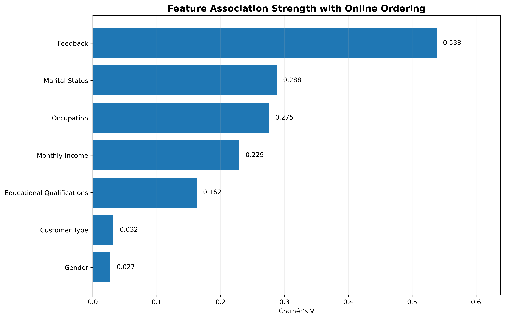
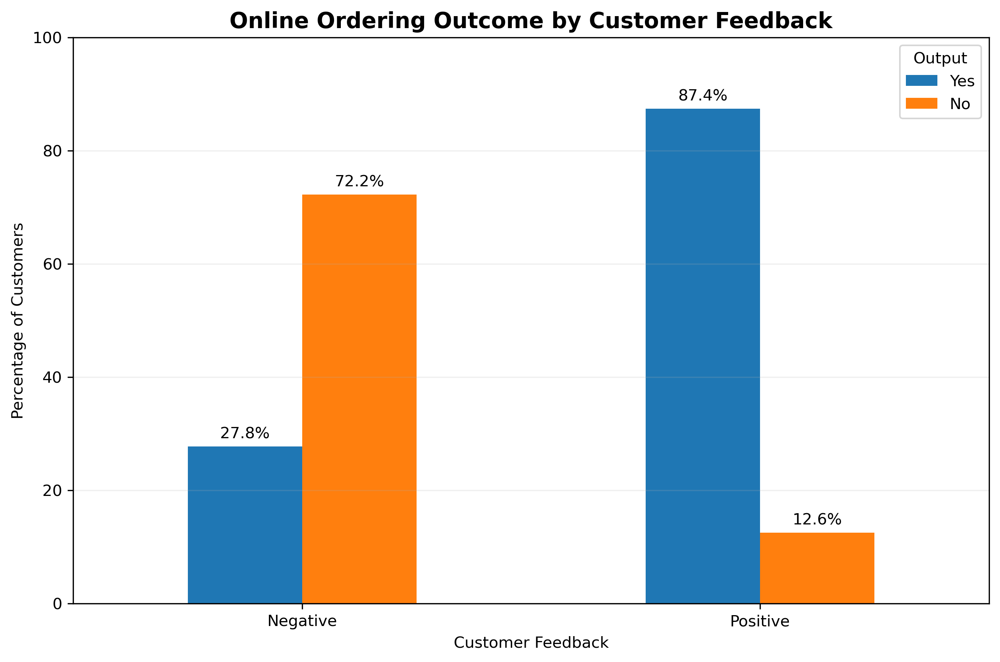
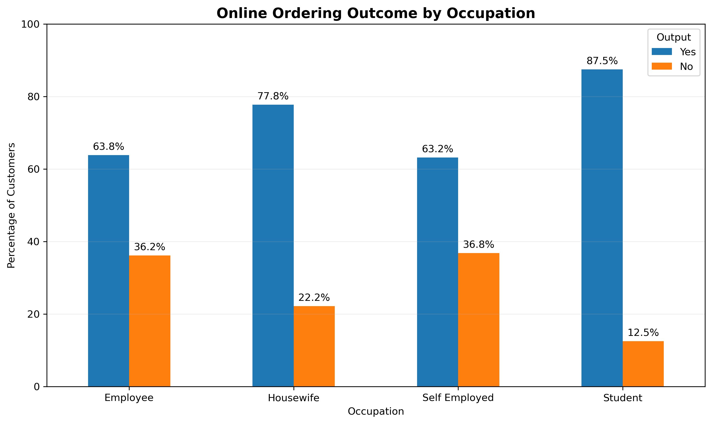
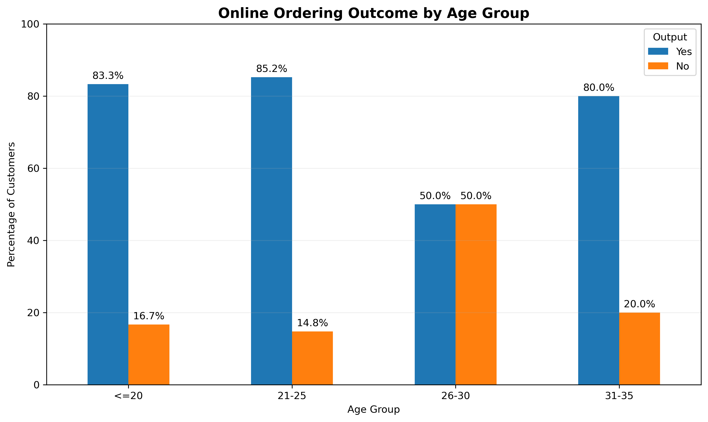
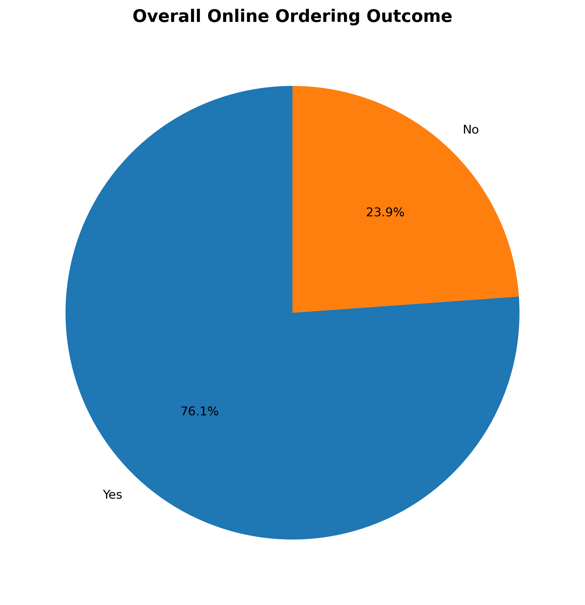
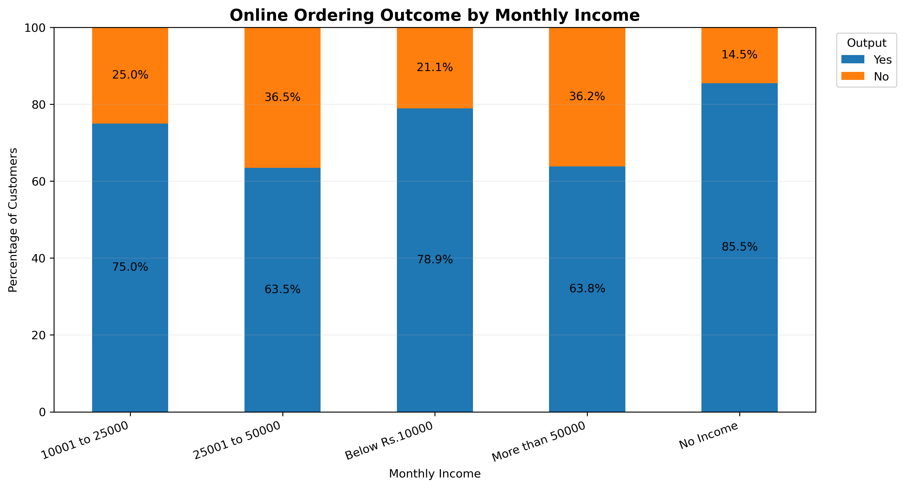
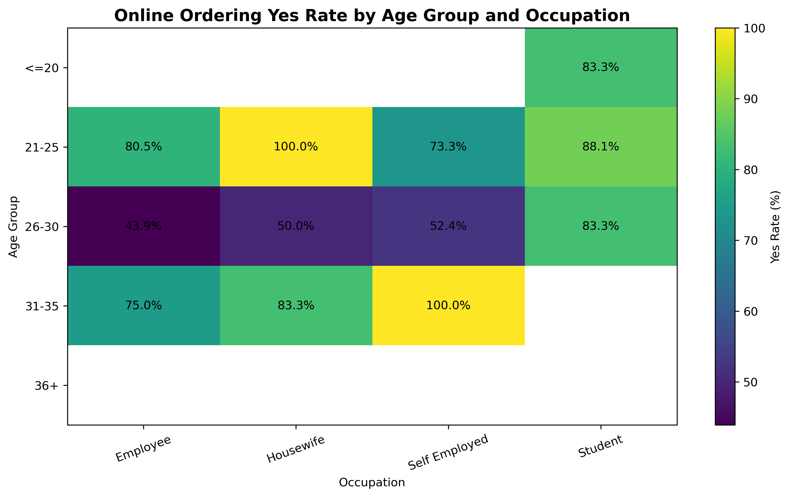

# Online Food Ordering Customer Behavior Analysis

## Project Overview

This project analyzes customer behavior in an online food ordering dataset using Python.

The main objective is to identify which customer characteristics are associated with a higher likelihood of online food ordering.

The analysis includes:

- Data cleaning
- Duplicate detection
- Exploratory Data Analysis (EDA)
- Cross-tabulation analysis
- Chi-Square statistical testing
- Cramér's V association strength
- Data visualization
- Customer behavior insights

## Dataset

The original dataset contained:

- 388 records
- 14 columns

During the data cleaning process:

- An unnecessary column was removed
- 103 duplicate rows were identified
- Duplicate records were removed

Final dataset:

**285 unique customer records**

No missing values were found.

## Tools & Technologies

- Python
- Pandas
- NumPy
- Matplotlib
- SciPy
- Jupyter Notebook

## Key Questions

The analysis focused on several questions:

1. Which customer groups are more likely to order food online?
2. Does occupation influence online ordering behavior?
3. Does monthly income affect ordering behavior?
4. Is age associated with online food ordering?
5. Does marital status influence ordering behavior?
6. How strongly is customer feedback associated with ordering outcomes?
7. Which variables show the strongest statistical association with the target variable?

## Target Variable

The main target variable used in the analysis is:

**Output**

Values:

- Yes
- No

Overall distribution:

- Yes: **76.14%**
- No: **23.86%**

## Key Insights

### 1. Customer Feedback

Customer feedback showed the strongest association with online ordering behavior.

- Positive Feedback → **87.45% Yes**
- Negative Feedback → **27.78% Yes**

Cramér's V:

**0.5381**

This was the strongest relationship found in the dataset.

### 2. Occupation

Students showed the highest online ordering rate.

- Student → **87.50% Yes**
- Housewife → **77.78% Yes**
- Employee → **63.83% Yes**
- Self Employed → **63.16% Yes**

However, sample size was considered when interpreting smaller groups.

### 3. Age

The 21–25 age group showed a particularly high online ordering rate.

- Age ≤20 → **83.33% Yes**
- Age 21–25 → **85.25% Yes**
- Age 26–30 → **50.00% Yes**
- Age 31–35 → **80.00% Yes**

The interaction between age and occupation was also investigated.

For example:

- Age 21–25 + Student → **88.10% Yes**
- Age 21–25 + Employee → **80.49% Yes**
- Age 26–30 + Employee → **43.90% Yes**

This suggests that both age and occupation are associated with ordering behavior.

### 4. Marital Status

Single customers showed a noticeably higher online ordering rate.

- Single → **84.66% Yes**
- Married → **60.92% Yes**

The difference also remained visible when comparing customers within the same occupation.

### 5. Monthly Income

Monthly income showed a statistically significant association with online ordering behavior.

However, the relationship was not linear.

For example:

- No Income → **85.50% Yes**
- Below Rs.10000 → **78.95% Yes**
- 10001–25000 → **75.00% Yes**
- 25001–50000 → **63.46% Yes**
- More than 50000 → **63.83% Yes**

Further analysis showed that the high ordering rate in the No Income group was largely related to the high number of students in this category.

This demonstrates the importance of considering **confounding variables** during analysis.

## Statistical Association Analysis

Chi-Square tests were used to identify which categorical variables showed a statistically significant relationship with the target variable (`Output`).

Cramér's V was then used to compare the relative strength of those associations.

### Main Findings

- **Customer Feedback** showed the strongest association with online ordering behavior.
- **Marital Status** and **Occupation** also showed meaningful relationships with the target variable.
- **Monthly Income** was statistically significant, although its effect appeared to be influenced by other variables such as occupation.
- **Educational Qualifications** showed only a weak relationship.
- **Customer Type** and **Gender** showed very little association with the target variable.

Overall, the analysis suggests that customer behavior is influenced more by experience and demographic context than by simple customer classification alone.

**Feedback > Marital Status > Occupation > Monthly Income**

were the most relevant categorical variables associated with the target variable.

## Visualizations

### Feature Association Strength

### Feedback vs Online Ordering

### Occupation vs Online Ordering

### Age Group vs Online Ordering

### Overall Online Ordering Distribution

### Monthly Income vs Online Ordering

### Age Group and Occupation Interaction

## Analytical Approach

A key part of this project was avoiding conclusions based only on percentages.

For each analysis, both percentage distributions and sample counts were reviewed.

This helped identify cases where high percentages were based on very small sample sizes.

The analysis also examined possible confounding effects between:

- Age
- Occupation
- Monthly Income
- Marital Status

## Conclusion

Customer feedback showed the strongest association with online ordering behavior.

Age, occupation, marital status, and monthly income also showed meaningful relationships with the target variable.

The project demonstrates how exploratory analysis, statistical testing, and visualization can be combined to understand customer behavior while avoiding misleading conclusions based solely on percentages.

## Author

**RAED ALSHAIKH**

Financial & Data Analyst  
Python | Power BI | Quantitative Research | Financial Modeling | Data Analysis
